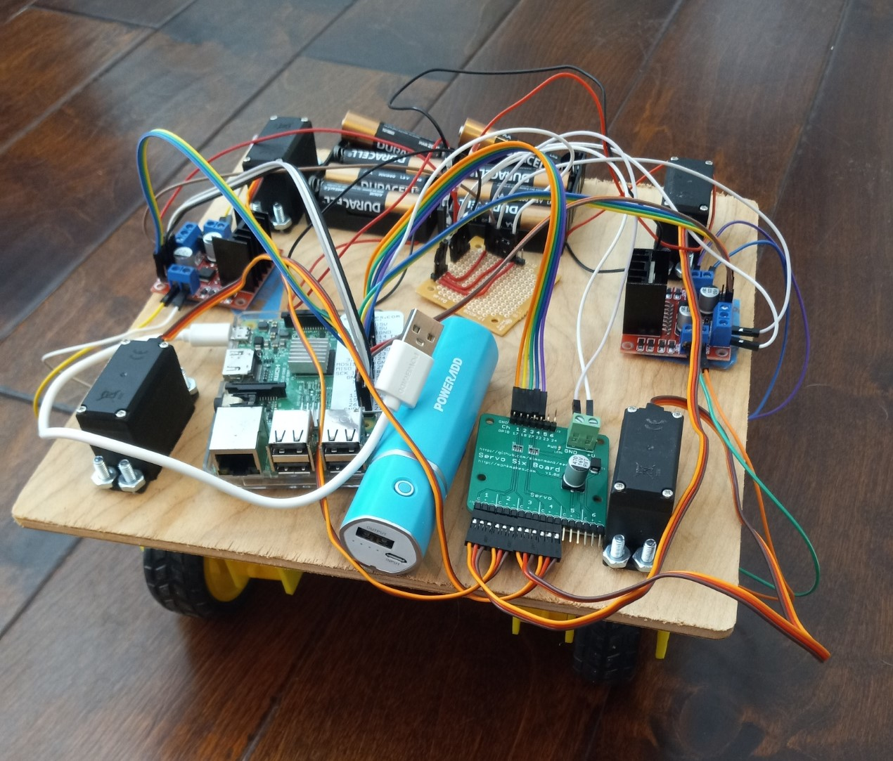

# Swervo Drive

A swerve drive built using servo motors.

[Video](https://drive.google.com/file/d/1B-IFKM3OorLOWtVjoWCk5ENqQle2b3FU/view?usp=sharing)

## Hardware

 - Raspberry Pi
 - Servosix servo controller
 - 2 L298N Motor Drivers
 - 4 DC Motors + Wheels
 - 4 MG996R Servos
 - 2 Battery Packs (parallel, 6v)
 - Phone external battery pack (powers RPi)
 - 4 3D printed wheel enclosures
 - CNC cut base

## Software
 - Python for control
 - HTML / JS for web UI
 - hostapd + dnsmasq for network

## Code Overview
 - RobotFlask.py - Webserver
 - RobotSetup.py - One time setup script
 - RobotManager.py - High level control logic
 - RobotHardware.py - Low level GPIO control
 - LogPrint.py - Debugging
 - robot_io.json - Hardware mapping
 - rpi.json - True: Runs code, False: Runs emulator